<!--
TODOS:

- verify how to gain fortune or lose all Reserve Scores, more speciailly Luck

Writing Guidelines

- Use Pascal Case for all mechanical terms: Great Success, Bare Success, Draw, Vitae, Radiance, Cost, and so on.
- When referencing an Action in text, use backticks like `Action Name`.
- Reserve the term Draw for the core resolution mechanic only. Use reveal when showing cards for tables, oracles, or random procedures.
- Write in third person only. Use the character, the player, or themselves. Never use you, your, or yourself.
- Use the Oxford comma in all lists.
- Avoid contractions. Write is not, do not, and cannot instead of isn't, don't, and can't.
- List card suits in this order: Clubs, Spades, Diamonds, Hearts.
- Phrase Action outcomes using present participles (-ing verbs) directly after the result. Put mechanical effects first, then narrative flavor.

Action Format:

1. Heading: Use level 4 heading (####) with the Action name.
2. Trigger: Start with "When a character [does something], Draw+[Score]." Use "Draw+appropriate Score" if multiple Scores apply.
3. Score Options (if appropriate Score): Use a bullet list starting with "If the character acts..." followed by "- With [method]: Draw+[Score]." End with "- If nothing else applies: Draw+Fortune."
4. Situational Modifiers: Use a blockquote (>) with "If [favorable condition], take 1 Advantage. If [unfavorable condition], take 1 Disadvantage."
5. Resolution Intro: Add "Then, resolve the Action as follows:" before the outcomes.
6. Outcomes: Use a bullet list with the following format:
   - Great Success: "On a Great Success, the character [narrative flavor], [mechanical effect]."
   - Bare Success: "On a Bare Success, the character [narrative flavor], [mechanical effect]."
   - Failure: "On a Failure, the character [narrative flavor], and there is a Cost."
7. Cost Table (optional): Add "On a Failure, the player may reveal a card to help determine the nature of the Cost:" followed by a suit-based bullet list in Clubs, Spades, Diamonds, Hearts order.

-->

```mermaid
flowchart TB
    subgraph Exploration["🔍 EXPLORATION"]
        OO[Overcome an Obstacle]
        FO[Forage]
    end

    subgraph Preparation["⚡ PREPARATION"]
        direction TB
        SO[Secure an Opportunity]
        SO_SUB["positioning | investigation | trust"]
    end

    subgraph Social["💬 SOCIAL"]
        CO[Compel]
    end

    subgraph Combat["⚔️ COMBAT"]
        EC[Enter Combat]
        IH[Inflict Harm]
        AC[Avoid a Consequence]
    end

    subgraph Recovery["💚 RECOVERY"]
        RE[Rest]
        TW[Treat Wounds]
        PU[Purify]
    end

    subgraph Power["🌿 POWER"]
        IG[Invoke Gift]
    end

    subgraph Thresholds["💀 THRESHOLDS"]
        RD[Resist Death]
        RF[Resist the Forest]
    end

    subgraph Resources["📊 RESOURCES"]
        VIT((Vitae))
        RAD((Radiance))
        SUP((Supply))
        FOR((Fortune))
        ADV((Advantage))
    end

    %% Advantage Generation
    OO -->|"Success: +1"| ADV
    SO -->|"Success: +2"| ADV
    EC -->|"Success: +1"| ADV

    %% Advantage Consumption
    ADV -.->|"spent on"| OO
    ADV -.->|"spent on"| IH
    ADV -.->|"spent on"| AC
    ADV -.->|"spent on"| CO

    %% Secure an Opportunity feeds into actions
    SO -.->|"intel/bonds"| CO
    SO -.->|"positioning"| IH
    SO -.->|"preparation"| OO

    %% Combat Flow
    EC -->|"initiates"| IH
    IH <-->|"triggers"| AC

    %% Vitae Damage
    IH -->|"Partial/Fail: Harm"| VIT
    AC -->|"Partial/Fail: Harm"| VIT

    %% Vitae Recovery
    RE -->|"restores 1-3"| VIT
    TW -->|"restores 1-2"| VIT

    %% Vitae Threshold
    VIT -->|"reaches 0"| RD
    RD -->|"Success: stabilize"| VIT

    %% Radiance Damage
    IG -->|"Partial/Fail"| RAD
    AC -->|"corruption"| RAD
    RE -->|"Cost: Unease"| RAD

    %% Radiance Recovery
    PU -->|"restores 1-3"| RAD

    %% Radiance Threshold
    RAD -->|"reaches 0"| RF

    %% Supply Flow
    FO -->|"restores 1-2"| SUP
    RE -->|"Cost: Consumption"| SUP
    TW -->|"Fail: -1"| SUP
    OO -->|"Cost: Loss"| SUP

    %% Fortune Flow - Tempting Fate
    FOR -->|"Push Through"| PUSH[Failure → Partial]
    ACCEPT[Success → Partial] -->|"Accept Hardship"| FOR

    %% Power amplifies actions
    IG -.->|"amplifies"| OO
    IG -.->|"amplifies"| IH
    IG -.->|"amplifies"| AC

    %% End states
    RD -->|"Failure"| DEATH[☠️ Death]
    RF -->|"Failure"| CLAIMED[🌳 Claimed]
```

**Wardens of the Duskwatch**

A penitent walks into the Derweald to cleanse their soul before they are lost and judged in the final reckoning.

## The Derweald

The Derweald of Lightwall is a living rot: ancient, patient, and eternally hungry. Its roots burrow through soil and soul alike, drinking names, memories, and blood. What dies beneath its boughs does not rest. The dead rise again as Pallids: bark-bound, hollow-eyed, and mindless, thralls to spirits the Church of the One Light swore it had vanquished centuries ago.

But when the claiming comes swift as the wind, a rare few rise again with their minds intact, cursed with gifts they never asked for and the forest's hooks buried deep in their thoughts. These creatures are power, hunger, and forever. They are called Thornmouths.

The Order of the Duskwatch hunts Thornmouths without mercy and searches for those with resolve enough to fight the pull of the roots through Radiance and faith to welcome into their ranks as Wardens. The Order's priests carve root scars into their forearms with consecrated steel and pack the wounds with blessed salt until the flesh rises into knotted patterns. Body and soul both becoming a battleground to help fight the pull and resist this corrupted power from taking over.

Armed with blessed blades, whispered prayers, and salted steel, the Wardens are sent back into the thorns to fulfill cleanse evil, or die trying.

## What Is Needed

One standard deck of cards shared among the table, paper, and pencil. The game can be played solo, cooperatively without a Game Master (GM), or with a GM and one to four players.

Card values follow this scale: Aces count as 1, numbered cards use their normal value, and face cards are valued at 11 for Jacks, 12 for Queens, and 13 for Kings.

Place used cards in a discard pile. When the deck runs empty, or whenever revealing a Joker, shuffle the discard pile to form a new deck.

## Making a Character

Players take a piece of paper (this will act as their character sheet) and then go through the following steps:

### 1. Name

Each player writes their own name on their character sheet.

### 2. Character Name

The player chooses a name for their character.

### 3. Scores

Scores measure a character's capabilities and resources.

**Core Scores** range from 0 to 5. During character creation, players distribute 8 points among the four Core Scores, with no single Score exceeding 3:

- **Strength**: Physical power. Governs brute force, heavy blows, and feats of might.
- **Dexterity**: Agility and precision. Governs quick reflexes, acrobatics, stealth, and ranged attacks.
- **Willpower**: Mental fortitude and presence. Governs resolve, perception, persuasion, and resisting corruption.
- **Constitution**: Endurance and toughness. Governs resilience, stamina, and resistance to physical hardship.

**Reserve Scores** fluctuate during play. All start at 5 during character creation, except Fortune which starts at 3:

- **Vitae (5)**: Physical and mental health.
- **Radiance (5)**: Inner light and resistance to corruption.
- **Supply (5)**: Provisions, ammunition, and expendable gear.
- **Fortune (3)**: Luck and fate's favor.

### 4. Records

Records are used to keep track of important facts about a character: specific items, bonds with non-player characters, pieces of intel, clues, lasting wounds, or other important notes. There is no limit to how many Records a character can have. Relevant Records can help or hinder a character when tackling challenging tasks or when trying to avoid a direct threat.

During character creation, the player reveals a card for each category to determine their starting Records:

- **Weapon** (reveal 1): 1. Sword, 2. Axe, 3. Spear, 4. Bow, 5. Flail, 6. Dagger, 7. Mace, 8. Greatsword, 9. Crossbow, 10. Halberd, Jack. Warhammer, Queen. Quarterstaff, King. Whip
- **Armor** (reveal 1): 1–3. Cloak or Clothes, 4–6. Leather, 7–9. Chain, 10–11. Plate, 12–13. Shield
- **Gear** (reveal 3): 1. Lantern, 2. Rope, 3. Crowbar, 4. Lockpicks, 5. Chain, 6. Grapnel, 7. Torch, 8. Vials, 9. Compass, 10. Spikes, Jack. Mirror, Queen. Chalk, King. Trap Kit
- **Skill** (reveal 1): 1. Herbalist, 2. Blademaster, 3. Marksman, 4. Ritualist, 5. Beast Tamer, 6. Duelist, 7. Scout, 8. Magehunter, 9. Pathfinder, 10. Skirmisher, Jack. Shadowblade, Queen. Deathseeker, King. Spellbreaker

### 5. Gift

A Gift is power stolen from the Derweald and held by rite and restraint. Each character has one, added as a Record. During character creation, players choose one gift:

- **Stonehide**: Flesh hardens like stone, making it extremely hard to be wounded.
- **Bonegrind**: Channel brutal force, gaining unnatural strength.
- **Vinewright**: Control the roots and thorns to entangle, snare, pierce, or drag.
- **Wildtongue**: Command the warped creatures of the forest to do your bidding.
- **Soulgrip**: Seize hold of another's emotions and bend them to your will.

## Rules

### The Oracle

The Oracle is used to answer questions when the fiction is uncertain. It can be consulted freely during play to resolve unknowns, or triggered by specific Actions. To consult the Oracle, frame a yes-or-no question and reveal cards based on likelihood:

| Likelihood     | Cards |
| -------------- | ----- |
| Almost Certain | 4     |
| Likely         | 3     |
| 50/50          | 2     |
| Unlikely       | 1     |

- When there are more red cards (Diamonds or Hearts) than black, the answer is **Yes**.
- When there are more black cards (Clubs or Spades) than red, the answer is **No**.
- When there is a tie, the answer is **Yes, but...** the results are extreme or there is an unexpected twist.

### Oracle Sparks

If after consulting the Oracle a player is still uncertain how things should unfold or how the result should be interpreted, the player reveals 2 cards from the deck. Match the first card to the Theme Spark table and the second to the Impulse Spark table to generate a creative prompt.

**Theme Spark** (reveal first card)

| Card | ♣ Clubs   | ♠ Spades   | ♦ Diamonds | ♥ Hearts   |
| ---- | --------- | ---------- | ---------- | ---------- |
| A    | Path      | Death      | Secret     | Vow        |
| 2    | Barrier   | Wound      | Truth      | Bond       |
| 3    | Shelter   | Fear       | Knowledge  | Faith      |
| 4    | Weapon    | Corruption | Power      | Hope       |
| 5    | Tool      | Ruin       | Wealth     | Memory     |
| 6    | Labor     | Decay      | Prize      | Spirit     |
| 7    | Land      | Enemy      | Trade      | Innocence  |
| 8    | Ruins     | Curse      | Debt       | Fellowship |
| 9    | Passage   | Shadow     | Resource   | Family     |
| 10   | Nature    | Blood      | Advantage  | Duty       |
| J    | War       | Vengeance  | Destiny    | Sacrifice  |
| Q    | Beast     | Doom       | Legacy     | Soul       |
| K    | The Order | The Forest | The Roots  | The Light  |

**Impulse Spark** (reveal second card)

| Card | ♣ Clubs     | ♠ Spades | ♦ Diamonds | ♥ Hearts  |
| ---- | ----------- | -------- | ---------- | --------- |
| A    | Journey     | Hunt     | Acquire    | Swear     |
| 2    | Search      | Strike   | Gather     | Confess   |
| 3    | Explore     | Threaten | Trade      | Mourn     |
| 4    | Breach      | Ambush   | Secure     | Aid       |
| 5    | Fortify     | Pursue   | Hide       | Protect   |
| 6    | Endure      | Wound    | Evade      | Serve     |
| 7    | Escape      | Corrupt  | Deceive    | Follow    |
| 8    | Uncover     | Betray   | Manipulate | Remember  |
| 9    | Investigate | Consume  | Reveal     | Restore   |
| 10   | Build       | Destroy  | Bargain    | Forgive   |
| J    | Command     | Defy     | Steal      | Sacrifice |
| Q    | Advance     | Avenge   | Transform  | Embrace   |
| K    | Conquer     | Claim    | Surrender  | Bless     |

### The Draw

All of the game's following mechanics are called Actions: things that trigger when characters do certain things in the fiction. When an Action is triggered, it will outline that the player must make a Draw, usually in the form of "When this happens, Draw+Score." Follow the steps below to resolve the Action's outcome.

#### Making a Draw

The player draws 1 Action card and adds the relevant Score to the card's numeral value. Then, 2 Challenge cards are drawn. The player compares their Action total against each Challenge card.

If the player's Action total is higher than both Challenge cards, the Action resolves as a **Great Success**. The character succeeds at what they were trying to do, and does so with greater effect.

If the player's Action total is higher than one Challenge card, the Action resolves as a **Bare Success**. The character succeeds, getting what they want.

If the player's Action total is higher than neither Challenge card, the Action resolves as a **Failure**. The character fails, and there is a Cost.

Each Action provides prompts to help determine what that Cost might be.

#### Advantage and Disadvantage

Advantage comes from favorable conditions, preparation, relevant Records, or invoking a Gift. For each level of Advantage, add +1 to the Action total.

Disadvantage comes from adverse conditions, wounds, missing gear, or hostile circumstances. For each level of Disadvantage, subtract 1 from the Action total.

#### Tempting Fate

Fortune can be spent or earned by pushing outcomes beyond what fate intended.

- **Push Through**: When a character suffers a Failure, the player may push the outcome to a Bare Success instead, losing 1 Fortune in the process.
- **Accept Hardship**: When a character achieves a Great Success, the player may choose to accept a Bare Success instead, restoring 1 Fortune in the process.

Fortune cannot go lower than 0 or higher than 5. A player cannot spend Fortune they do not have.

### Actions

#### Overcome a Challenge

When a character faces a challenge, Draw+appropriate Score. If the character acts...

- With brute force, aggression, or raw power: Draw+Strength.
- With speed, agility, precision, or stealth: Draw+Dexterity.
- With cunning, perception, persuasion, or mental fortitude: Draw+Willpower.
- With endurance, resilience, or toughness: Draw+Constitution.
- If nothing else applies: Draw+Fortune.

> If the character is well-prepared or conditions are favorable, take 1 Advantage. If the character is hindered or conditions are hostile, take 1 Disadvantage.

Then, resolve the Action as follows:

- **On a Great Success**: The character greatly succeeds.
- **On a Bare Success**: The character succeeds.
- **On a Failure**: The character fails, and there is a Cost.

On a Failure, the player may reveal a card to help determine the nature of the Cost:

- **♣ Clubs**: Time. The character loses precious time or an opportunity slips away.
- **♠ Spades**: Danger. The character suffers harm or attracts a threat.
- **♦ Diamonds**: Loss. The character loses Supply or valuable gear is damaged.
- **♥ Hearts**: Trust. A relationship is strained or an ally is put at risk.

#### Avoid a Consequence

When a character tries to avoid a consequence from a hazard, hostile opposition, or dangerous environment, Draw+appropriate Score. If the character reacts...

- With brute force, blocking, or standing firm: Draw+Strength.
- With speed, dodging, or quick reflexes: Draw+Dexterity.
- With focus, willpower, or mental resistance: Draw+Willpower.
- With endurance, resilience, or toughness: Draw+Constitution.
- If nothing else applies: Draw+Fortune.

> If the threat is serious, take 1 Disadvantage. If the threat is dire, take 2 Disadvantage.

Then, resolve the Action as follows:

- **On a Great Success**: The character avoids the consequence and gains an opportunity, taking 1 Advantage for their next Action when applicable.
- **On a Bare Success**: The character avoids the consequence.
- **On a Failure**: The character suffers the full consequence. When suffering harm, lose Vitae. When fighting corruption, lose Radiance. If nothing else applies, the consequence is rooted in the fiction.

The amount of Vitae or Radiance lost depends on the severity of the threat: minor threats deal 1, serious threats deal 2, and dire threats deal 3 or more.

If a character's Vitae ever reaches 0, they must immediately use the `Resist Death` Action.

#### Secure an Opportunity

When a character prepares for what lies ahead, whether through positioning, investigation, or building trust, Draw+appropriate Score. If the character acts...

- With intimidation, a show of force, or holding ground: Draw+Strength.
- With positioning, searching, sneaking, or observation: Draw+Dexterity.
- With patience, endurance, or sharing hardship: Draw+Constitution.
- With planning, deduction, persuasion, or reading people: Draw+Willpower.
- By paying for information or offering trade: Draw+Supply.
- If nothing else applies: Draw+Fortune.

> If the character has time to prepare, the situation is calm, or the source is cooperative, take 1 Advantage. If the character is rushed, under pressure, or the source is guarded, take 1 Disadvantage.

Then, resolve the Action as follows:

- **On a Great Success**: The character secures the opportunity, creating 2 Advantage that can be used on a future Action. If relevant, add a bond, clue, or piece of intel as a Record.
- **On a Bare Success**: The character secures the opportunity, creating 1 Advantage that can be used on a future Action. If relevant, add a bond, clue, or piece of intel as a Record.
- **On a Failure**: The character fails to secure the opportunity, and there is a Cost.

On a Failure, the player may reveal a card to help determine the nature of the Cost:

- **♣ Clubs**: Time. The opportunity slips away, or an obligation is now owed.
- **♠ Spades**: Danger. The character attracts a threat or reveals something personal.
- **♦ Diamonds**: Loss. The character loses Supply, or a debt must be paid first.
- **♥ Hearts**: Trust. A relationship is strained, or word spreads about the character's methods.

#### Forage

When a character searches for food, water, or useful materials in the wild, Draw+Fortune.

> If the area is plentiful (near fresh water, fertile land, or abundant game), take 1 Advantage. If the area is barren or corrupted, take 1 Disadvantage.

Then, resolve the Action as follows:

- **On a Great Success**: The character finds what they need and more, restoring 2 Supply.
- **On a Bare Success**: The character finds enough to get by, restoring 1 Supply.
- **On a Failure**: The character finds nothing, and there is a Cost.

On a Failure, the player may reveal a card to help determine the nature of the Cost:

- **♣ Clubs**: Time. The search takes far longer than expected.
- **♠ Spades**: Danger. The character attracts predators or stumbles into a threat.
- **♦ Diamonds**: Loss. Gear is damaged or lost during the search.
- **♥ Hearts**: Exposure. The character suffers exhaustion or minor harm. Lose 1 Vitae.

#### Treat Wounds

When a character tends to injuries or wounds, Draw+appropriate Score. If the character acts...

- To treat injuries on others: Draw+Dexterity.
- To treat wounds on themselves: Draw+Constitution.

> If the character has proper supplies or shelter, take 1 Advantage. If the character lacks supplies or is exposed, take 1 Disadvantage.

Then, resolve the Action as follows:

- **On a Great Success**: The character treats the wounds effectively, restoring 2 Vitae.
- **On a Bare Success**: The character treats the wounds adequately, restoring 1 Vitae.
- **On a Failure**: The character fails to treat the wounds, and there is a Cost.

On a Failure, the player may reveal a card to help determine the nature of the Cost:

- **♣ Clubs**: Time. The treatment takes far longer than expected.
- **♠ Spades**: Complication. The wound worsens or becomes infected.
- **♦ Diamonds**: Waste. Supplies are consumed without effect. Lose 1 Supply.
- **♥ Hearts**: Strain. The effort takes a toll on the healer. Lose 1 Vitae.

#### Enter Combat

When a character initiates combat or reacts to an ambush, Draw+Dexterity.

> If the character is prepared or has the element of surprise, take 1 Advantage. If the character is caught off guard or outnumbered, take 1 Disadvantage.

Then, resolve the Action as follows:

- **On a Great Success**: The character seizes initiative, taking 1 Advantage for their next Action.
- **On a Bare Success**: The character engages on equal footing.
- **On a Failure**: The character loses initiative, taking 1 Disadvantage on their next Action.

There is no turn order or rounds. This Action establishes who acts first, then the fiction flows back and forth between the characters and their enemies. Players usually act using `Inflict Harm`, `Overcome a Challenge`, or `Secure an Opportunity`. When enemies strike back, the GM prompts players to react using `Avoid a Consequence`.

#### Inflict Harm

When a character strikes at an enemy or engages a threat in combat, Draw+appropriate Score. If the character attacks...

- With a melee weapon or bare hands: Draw+Strength.
- With a ranged weapon or thrown object: Draw+Dexterity.
- With arcane power or a Gift: Draw+Willpower.

> If the character has the upper hand or the enemy is exposed, take 1 Advantage. If the enemy is armored, fortified, or has the upper hand, take 1 Disadvantage.

Then, resolve the Action as follows:

- **On a Great Success**: The character strikes true and gains an opportunity, taking 1 Advantage for their next Action.
- **On a Bare Success**: The character lands the strike.
- **On a Failure**: The character misses, and there is a Cost.

On a Failure, the player may reveal a card to help determine the nature of the Cost:

- **♣ Clubs**: Position. The enemy gains the upper hand or forces the character back.
- **♠ Spades**: Harm. The character suffers harm in retaliation. Lose 1 Vitae.
- **♦ Diamonds**: Loss. A weapon is damaged, dropped, or stuck.
- **♥ Hearts**: Exposure. An ally is put in danger or the character is left vulnerable.

Minor foes fall in one or two strikes. Dangerous foes require multiple successful attacks. The fiction dictates what is possible during combat. A blade or arrow cannot harm what it cannot reach or pierce. An armored creature will not fall to desperate slashing, etc.

#### Resist Death

When a character's Vitae reaches 0, the character is on the brink of death. Draw+Fortune.

Then, resolve the Action as follows:

- **On a Great Success**: The character clings to life, regaining 1 Vitae but remaining conscious.
- **On a Bare Success**: The character barely survives, stabilizing at 1 Vitae but falling unconscious. Add a permanent wound as a Record.
- **On a Failure**: The character succumbs to their wounds.

#### Resist the Forest

When a character's Radiance reaches 0, the pull of the forest threatens to consume them. Draw+Fortune.

Then, resolve the Action as follows:

- **On a Great Success**: The character resists the call, regaining 1 Radiance.
- **On a Bare Success**: The character holds on, stabilizing at 1 Radiance but feeling the roots take hold. Add a permanent mark of corruption as a Record.
- **On a Failure**: The character succumbs to the forest.

#### Rest

When a character spends 6+ hours resting, Draw+appropriate Score. If the character rests...

- In a safe place or shelter: Draw+Constitution.
- In the wilds or while on the move: Draw+Supply.

> If the area is sheltered or defensible, take 1 Advantage. If finds a true sanctuary, take 2 Advantage. If the area is exposed or deep in corrupted territory, take 1 Disadvantage.

Then, resolve the Action as follows:

- **On a Great Success**: The character rests fully, restoring 3 Vitae.
- **On a Bare Success**: The character rests adequately, restoring 2 Vitae.
- **On a Failure**: The character rests poorly, restoring only 1 Vitae, and there is a Cost.

On a Failure, the player may reveal a card to help determine the nature of the Cost:

- **♣ Clubs**: Delay. The rest takes longer than expected or an opportunity passes.
- **♠ Spades**: Disturbance. Something stirs in the night, danger approaches.
- **♦ Diamonds**: Consumption. Supplies are depleted or gear is damaged. Lose 1 Supply.
- **♥ Hearts**: Unease. Nightmares or troubled thoughts strain the mind. Lose 1 Radiance.

After a character has rested, shuffle the discard pile back into the deck.

#### Purify

When a character seeks to cleanse their soul and resist the forest's claim, Draw+Willpower.

> If the character is at a place of holiness (a shrine, altar, sacred grove, or sanctuary blessed by the Church), take 1 Advantage. If the character performs a rite of purification (confessing sins at a relic, holding vigil while fasting, praying over running water, or pouring blood into salt), take 1 Advantage.

Then, resolve the Action as follows:

- **On a Great Success**: The character is imbued with the One Light, restoring 3 Radiance.
- **On a Bare Success**: The character feels the touch of the One Light, restoring 2 Radiance.
- **On a Failure**: The character is only lightly touched by the One Light, restoring 1 Radiance.

#### Invoke Gift

When a character calls upon their Gift to overcome an obstacle or solve a problem, Draw+Willpower.

Then, resolve the Action as follows:

- **On a Great Success**: The character invokes their Gift, keeping their Radiance.
- **On a Bare Success**: The character invokes their Gift, losing 1 Radiance.
- **On a Failure**: The character loses control of their Gift, losing 2 Radiance.

If a character's Radiance ever reaches 0, they must immediately use the `Resist the Forest` Action.

## Getting Started

### The Opening Scene

Each player introduces their character: their name, what they look like, and one memory from before the claiming. Then frame the opening: the group is already mid-mission, deep in the thorns, with their Vow half-complete and trouble closing in.

### Group Vow

A Vow is a mission, the purpose that keeps the Order's mercy pointed forward. When the group completes a Vow, each character restores their Radiance to 5 and the group takes on a new Vow.

To generate a Vow, draw one card from each table and combine the results. Or choose elements that speak to you.

**The Task** (draw one card)

| Card | Task                       |
| ---- | -------------------------- |
| A    | Find                       |
| 2    | Bring back                 |
| 3    | Destroy                    |
| 4    | Free                       |
| 5    | Deliver to safety          |
| 6    | Learn the fate of          |
| 7    | Break the hold on          |
| 8    | Contain                    |
| 9    | Avenge                     |
| 10   | Recover the secret held by |
| J    | Consecrate                 |
| Q    | Protect                    |
| K    | Grant final rest to        |

**The Subject** (draw one card)

| Card | Subject                                 |
| ---- | --------------------------------------- |
| A    | a child who wandered too deep           |
| 2    | a Warden who went silent                |
| 3    | a merchant who knew the old paths       |
| 4    | a noble's forsaken heir                 |
| 5    | a priest who sought forbidden knowledge |
| 6    | one who wears a stolen shape            |
| 7    | an elder who kept dangerous secrets     |
| 8    | a hunter who became the hunted          |
| 9    | the last keeper of a holy relic         |
| 10   | one who betrayed the Order              |
| J    | a voice that calls from the thorns      |
| Q    | a witch of the deep groves              |
| K    | something the forest remembers          |

**The Complication** (draw one card, use suit)

| Suit       | Complication                          |
| ---------- | ------------------------------------- |
| ♣ Clubs    | Others hunt the same quarry           |
| ♠ Spades   | Someone here shares history with them |
| ♦ Diamonds | The path back has closed              |
| ♥ Hearts   | The truth is worse than told          |

**The Location** (draw one card)

| Card | Location                              |
| ---- | ------------------------------------- |
| A    | a chapel swallowed by roots           |
| 2    | a village that went silent            |
| 3    | a ravine where the mist never lifts   |
| 4    | an abandoned Warden outpost           |
| 5    | a crossroads marked by the hanged     |
| 6    | a river that runs black after dark    |
| 7    | a grove where the trees have faces    |
| 8    | the ruins of a noble estate           |
| 9    | a cave network beneath the roots      |
| 10   | a bridge guarded by something patient |
| J    | a shrine to a forgotten god           |
| Q    | a clearing where nothing grows        |
| K    | the heart of an old corruption        |
